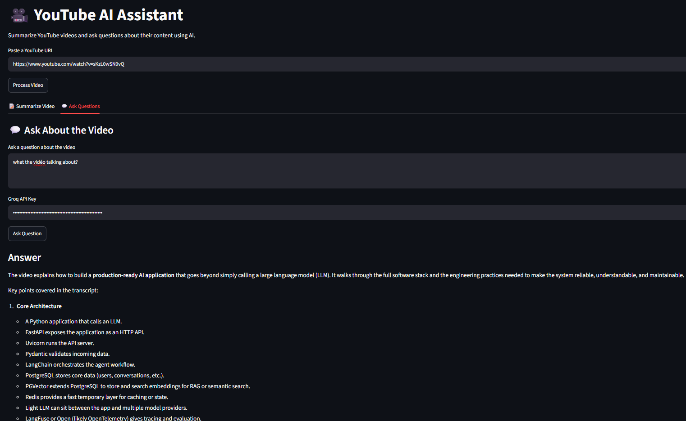
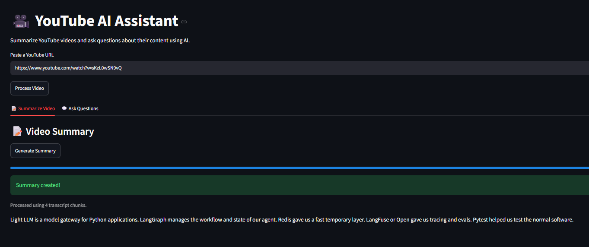

# 🎥 YouTube AI Assistant

A learning project built to practice **Hugging Face**, **LangChain**, **Retrieval-Augmented Generation (RAG)**, and **LLM integration**.

The application allows a user to provide a YouTube video URL and then:

1. Generate an AI summary of the video.
2. Ask questions about the content of the video.

The project combines two AI approaches:

- **Text Summarization** using a Hugging Face model.
- **Question Answering with RAG** using LangChain, embeddings, FAISS, and the Groq API.

The main goal of this project is not only to build an application, but to understand how different AI tools can work together in a complete workflow.

---

# 📚 Learning Goals

This project was created to practice and better understand:

- Hugging Face models and tokenizers
- Hugging Face Transformers
- Text summarization
- LangChain text splitters
- Document processing
- Embeddings
- Vector databases
- FAISS
- Similarity search
- Retrieval-Augmented Generation (RAG)

---

# 🚀 Features

## 📝 Video Summarization

The application can:

- Extract a YouTube video transcript.
- Process long transcripts.
- Split the transcript into smaller chunks.
- Summarize each chunk individually.
- Combine the chunk summaries.
- Generate a final summary.

The summarization feature uses the Hugging Face model:

```text
facebook/bart-large-cnn
```

---

## 💬 Ask Questions About the Video

The application also allows the user to ask questions about the video.

For example:

```text
What is the main idea of the video?
```

The application searches the video transcript for the most relevant information and sends that information to an LLM to generate an answer.

The answer is based on the transcript rather than the model's general knowledge.

---

# 🏗️ Application Architecture

The application starts with a YouTube URL.

```text
                    YouTube URL
                        │
                        ▼
                Extract Video ID
                        │
                        ▼
                 Get Transcript
                        │
                        ▼
                Full Video Transcript
                        │
              ┌─────────┴─────────┐
              │                   │
              ▼                   ▼
       Summarization             RAG
              │                   │
              ▼                   ▼
       Split into chunks     Split into chunks
              │                   │
              ▼                   ▼
       Hugging Face BART       Embeddings
              │                   │
              ▼                   ▼
       Chunk summaries          FAISS
              │                   │
              ▼                   ▼
       Final summary      Similarity Search
                                      │
                                      ▼
                                   Groq LLM
                                      │
                                      ▼
                                    Answer
```

---

# 🔄 Complete Workflow

The user first enters a YouTube URL.

```text
https://www.youtube.com/watch?v=VIDEO_ID
```

The application then:

1. Extracts the video ID.
2. Downloads the video transcript.
3. Stores the transcript in Streamlit session state.
4. Creates a FAISS vector database for the Q&A feature.
5. Allows the user to choose between:
   - Summarizing the video.
   - Asking questions about the video.

One important design decision in this project is that the transcript is retrieved only once.

Both the summarization and question-answering features use the same transcript.

```text
                 YouTube Video
                      │
                      ▼
                 Transcript
                      │
          ┌───────────┴───────────┐
          │                       │
          ▼                       ▼
     Summarization            Question Answering
```

This avoids downloading and processing the same transcript multiple times.

---

# 🤖 Part 1: Hugging Face Summarization

## Model

The project uses:

```text
facebook/bart-large-cnn
```

BART is a sequence-to-sequence model that can generate summaries from text.

The model and tokenizer are loaded using Hugging Face Transformers.

```python
from transformers import (
    AutoTokenizer,
    AutoModelForSeq2SeqLM
)

model_name = "facebook/bart-large-cnn"

tokenizer = AutoTokenizer.from_pretrained(
    model_name
)

model = AutoModelForSeq2SeqLM.from_pretrained(
    model_name
)
```

---

# 🧩 Why Text Splitting Is Necessary

Language models have limitations on how much text they can process at one time.

A YouTube video can have a very long transcript, especially for long videos 

Sending the complete transcript directly to the summarization model may exceed its input limit.

To solve this problem, the project uses:

```text
RecursiveCharacterTextSplitter
```

from LangChain.

Example:

```python
from langchain_text_splitters import (
    RecursiveCharacterTextSplitter
)

text_splitter = RecursiveCharacterTextSplitter(
    chunk_size=3000,
    chunk_overlap=200
)

chunks = text_splitter.split_text(
    transcript
)
```

The long transcript becomes:

```text
Long Transcript
       │
       ▼
LangChain Text Splitter
       │
       ▼

Chunk 1
Chunk 2
Chunk 3
Chunk 4
...
```

The overlap helps preserve context between neighboring chunks.

For example:

```text
Chunk 1:
[--------- Previous Context ---------]

Chunk 2:
                [--------- New Context ---------]
```

Without overlap, important information at the boundary between two chunks could be separated.

---

# 🧠 Map-Reduce Style Summarization

The application uses a multi-step summarization approach.

## Step 1: Split the Transcript

```text
Full Transcript
       │
       ▼
Split into chunks
       │
 ┌─────┼─────┐
 ▼     ▼     ▼

Chunk1 Chunk2 Chunk3
```

---

## Step 2: Summarize Each Chunk

Each chunk is sent to the Hugging Face BART model.

```text
Chunk 1 ───► BART ───► Summary 1

Chunk 2 ───► BART ───► Summary 2

Chunk 3 ───► BART ───► Summary 3
```

---

## Step 3: Combine the Summaries

The summaries are combined.

```text
Summary 1
    +
Summary 2
    +
Summary 3
```

---

## Step 4: Generate a Final Summary

The combined summaries are sent to the model again.

```text
Combined Summaries
        │
        ▼
       BART
        │
        ▼
   Final Summary
```


---

# 💬 Part 2: Asking Questions About the Video

The second part of the project uses a RAG-style workflow.

RAG stands for:

```text
Retrieval-Augmented Generation
```

Instead of sending the entire transcript to the LLM every time the user asks a question, the application first searches for the most relevant parts of the transcript.

The workflow looks like this:

```text
                  Video Transcript
                         │
                         ▼
                  Split into Chunks
                         │
                         ▼
                    Embeddings
                         │
                         ▼
                  FAISS Vector DB
                         │
                         │
User Question ───────────┘
         │
         ▼
   Similarity Search
         │
         ▼
Relevant Transcript Chunks
         │
         ▼
      Prompt + Context
         │
         ▼
       Groq LLM
         │
         ▼
        Answer
```

---

# 📄 Documents in LangChain

The transcript is converted into a LangChain `Document`.

```python
from langchain_core.documents import Document

document = Document(
    page_content=transcript
)
```

This allows the transcript to be processed using LangChain components.

---

# ✂️ Splitting Documents

The transcript is split into smaller documents.

```python
text_splitter = RecursiveCharacterTextSplitter(
    chunk_size=1000,
    chunk_overlap=100
)

docs = text_splitter.split_documents(
    [document]
)
```

These chunks are later converted into embeddings.

---

# 🔢 What Are Embeddings?

Embeddings convert text into numerical representations.


The important idea is that text with similar meanings will have numerical representations that are close to each other.


---

# 🤗 Hugging Face Embeddings

The project uses the following embedding model:

```text
sentence-transformers/all-MiniLM-L6-v2
```

The model is loaded using LangChain's Hugging Face integration.

```python
from langchain_huggingface import HuggingFaceEmbeddings

embeddings = HuggingFaceEmbeddings(
    model_name=
    "sentence-transformers/all-MiniLM-L6-v2"
)
```

The transcript chunks are converted into vector embeddings.

```text
Chunk 1
   │
   ▼
Embedding Model
   │
   ▼
Vector

Chunk 2
   │
   ▼
Embedding Model
   │
   ▼
Vector
```

---

# 🗄️ FAISS Vector Database

The embeddings are stored using FAISS.

FAISS allows the application to search for the transcript chunks that are most relevant to a user's question.

```python
from langchain_community.vectorstores import FAISS

db = FAISS.from_documents(
    docs,
    embeddings
)
```

Conceptually:

```text
Transcript Chunk
       │
       ▼
    Embedding
       │
       ▼
FAISS Vector Database
```

When the user asks a question:

```text
User Question
      │
      ▼
Question Embedding
      │
      ▼
Similarity Search
      │
      ▼
Most Relevant Chunks
```

---

# 🔍 Similarity Search

The application retrieves the most relevant transcript chunks.

```python
docs = db.similarity_search(
    query,
    k=4
)
```

In this case:

```text
k = 4

means the application retrieves four relevant chunks.

```


This is more efficient than sending the entire transcript.

---

# 🧠 Groq and the LLM


The application then sends:

```text
User Question
        +
Relevant Transcript Context
```

to the LLM.

The project uses Groq through LangChain:


The model generates an answer based on the retrieved context.

The project uses a prompt that instructs the LLM to answer only using information from the transcript.

---


# ⚡ Streamlit Caching

The project uses:

```python
@st.cache_resource
```

For example:

```python
@st.cache_resource
def load_summarization_model():

    return summarizer.load_model()
```

This helps avoid repeatedly downloading or loading the BART model.

Caching improves the user experience and reduces unnecessary computation.


# 📦 Technologies Used

| Technology | Purpose |
|---|---|
| Python | Main programming language |
| Streamlit | Web interface |
| Hugging Face Transformers | Loading and running the BART model |
| Hugging Face Hub | Accessing pre-trained models |
| BART | Text summarization |
| LangChain | Text splitting and AI workflow components |
| HuggingFaceEmbeddings | Creating text embeddings |
| Sentence Transformers | Semantic text representations |
| FAISS | Vector similarity search |
| Groq | LLM inference |
| youtube-transcript-api | Retrieving YouTube transcripts |
| python-dotenv | Managing environment variables |


---

# 🎯 Main Purpose of This Project

The primary purpose of this project is **learning**.

Rather than using only one API to summarize and answer questions, the project explores different parts of a modern AI application.

The summarization feature helped me practice:

- Working directly with a Hugging Face model.
- Loading tokenizers and models.
- Understanding model input limitations.
- Processing long text.
- Using chunking and multi-stage summarization.

The question-answering feature helped me practice:

- LangChain documents.
- Text splitting.
- Embeddings.
- FAISS vector databases.
- Semantic similarity search.
- RAG workflows.
- Prompt templates.
- LLM integration using Groq.

By combining these features, the project demonstrates a complete workflow from:

```text
YouTube Video
      ↓
Transcript
      ↓
Text Processing
      ↓
AI Models
      ↓
Summary + Question Answering
```

---



